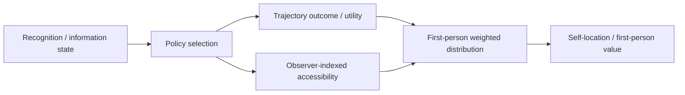

# Quantum Bogosort (QBS)

[](https://github.com/Unjuno/quantum-bogosort/actions/workflows/validate.yml)

Quantum Bogosort is a formal research program for recognition-dependent policies whose trajectories and observer-indexed accessibility can change together.

The motivating question is self-referential: if an agent recognizes a QBS-type rule and that information changes the policy it uses, while the resulting policy also changes which future continuations are observer-accessible, how does accessibility conditioning change the agent's first-person distribution over trajectories and present self-location? The model keeps the base probability law fixed; interpreting the accessibility weighting as an Everettian physical self-location rule is a separate bridge assumption.

The name **Quantum Bogosort** labels this observer-selection intuition. The formal object studied here is the recognition-dependent weighted-measure model below, not a claim that quantum mechanics literally sorts branches by utility.

The core structure is:

```math
R
\longrightarrow
\pi_R
\longrightarrow
(U_R,S_R).
```

Here `R` is recognition, `pi_R` is the policy used under that recognition state, `U_R` is the resulting outcome or utility, and `S_R` is a nonnegative observer-indexed accessibility weight.

In the self-referential case motivating QBS, `R=1` may represent recognition of a QBS-type rule itself. Recognition has no privileged causal power in the formal model: it matters only through any policy change it induces and the resulting changes in `U_R` and/or `S_R`. If recognition changes neither quantity, the recognition-label null gives no QBS effect.

## Visual model



The Mermaid diagram is an interpretation-neutral map of the formal dependencies. It is not a literal diagram of quantum branching.

The same dependency structure is also committed as a static SVG fallback for renderers that do not display Mermaid:

[](figures/README.md)

## Core first-person quantity

The normalized accessibility **measure** requires:

```math
S_\pi\ge0,
\qquad
0<E_\mu[S_\pi]<\infty.
```

For the finite mean/covariance identities below, also assume:

```math
E_\mu[|U_\pi|]<\infty,
\qquad
E_\mu[|U_\pi|S_\pi]<\infty.
```

Base integrability and weighted integrability are separate requirements; neither one implies the other in general.

Define:

```math
V_{FP}(\pi)
=
\frac{E_\mu[U_\pi S_\pi]}{E_\mu[S_\pi]}.
```

For the baseline:

```math
S_0\equiv1,
```

the recognition effect decomposes as:

```math
V_1-V_0
=
E[U_1-U_0]
+
\frac{\mathrm{Cov}(U_1,S_1)}{E[S_1]}.
```

The first term is the ordinary policy/trajectory effect. The second is the first-person conditioning contribution.

The general selector-changing T5 interaction decomposition introduces `Q(U_1,S_0)` and therefore additionally assumes:

```math
E[|U_1|S_0]<\infty.
```

A positive conditioning contribution means that the first-person measure gives greater weight to favorable accessible trajectories. It does **not** mean that the base measure or an external random-number generator is causally changed.

## Present self-location under future accessibility

The same weighted measure can be restricted to a present state while accessibility is determined over a future continuation. Let `Z` denote a present state or present trajectory descriptor and let `S_T` denote future-continuation accessibility. Then:

```math
P_{FP}(Z\in A)
=
\frac{E[\mathbf 1_{\{Z\in A\}}S_T]}{E[S_T]}.
```

For a discrete present state:

```math
P_{FP}(Z=z)
=
\frac{E[S_T\mid Z=z]P(Z=z)}{E[S_T]}.
```

Thus, when expected future accessibility differs across present states, the first-person measure can reweight present self-location toward states with greater expected future accessibility. This is a conditioning/change-of-measure statement, not backward causation and not a causal change in the base probability law.

A favorable or upward shift requires additional alignment between the relevant outcome/favorability statistic and future accessibility; differential accessibility alone gives reweighting, not a guaranteed favorable direction.

## What is established

### Core mathematics

The locked core theorem set is T1–T5:

1. covariance identity for the first-person mean shift;
2. tail-probability covariance identity;
3. a monotone-accessibility sufficient condition for FOSD;
4. recognition decomposition;
5. policy–QBS interaction decomposition.

The identities and proofs are unchanged from the frozen v0.3 theorem set, while `main` now makes the base/weighted integrability domain and the T5 cross-integrability requirement explicit. See [`theory/core_theorems.md`](theory/core_theorems.md) and the canonical [`docs/research_map.md`](docs/research_map.md).

### Supplementary predictive-alignment line

The current supplementary argument is organized around one conceptual spine:

```math
\text{predictive signal}
\longrightarrow
\text{conditional-mean alignment}
\longrightarrow
\text{outcome/accessibility covariance}
\longrightarrow
\text{first-person shift}.
```

Its principal results are S2, S2.11, S2.12, and S2.13. S2.3–S2.10 provide calibration, finite-sample, selection-validity, light-tail, and robust statistical-certification machinery. See [`supplementary/README.md`](supplementary/README.md).

### Recursive observer-information extension

An unnumbered supplementary extension closes the dynamic feedback step:

```math
\text{experienced observer history}
\longrightarrow
\text{belief / recognition update}
\longrightarrow
\text{adoption and policy}
\longrightarrow
\text{trajectory and accessibility}
\longrightarrow
\text{next experienced observer history}.
```

Relative to the information available when each decision is made, cumulative outcome is separated into a predictable component and a zero-base-conditional-mean innovation component. Applying the existing weighted-measure identity then separates **predictable selection** from **innovation selection**. The latter is a filtration-relative diagnostic for first-person reweighting of decision-time-unpredictable variation; it is not an objective physical luck parameter.

The same extension permits a specified QBS observer model and a specified null observer model to update bridge belief through ordinary likelihood ratios. Under correctly specified conditional models, the expected one-step log likelihood ratio has the corresponding KL-divergence sign. These are standard probability/information-theoretic facts used to close the feedback arrow, not evidence that the physical bridge is correct.

See [`supplementary/evidence_activation.md`](supplementary/evidence_activation.md). The exploratory [`supplementary/recursive_qbs_simulation.py`](supplementary/recursive_qbs_simulation.py) includes aligned, anti-aligned, and policy-only controls and remains outside the locked E1–E5 suite.

### Reproducible simulations

The locked core experiment suite is E1–E5:

- [`experiments/E1_FOSD.md`](experiments/E1_FOSD.md) — covariance, tails, FOSD, independence null, and a nonmonotone counterexample;
- [`experiments/E2_LEARNED_AGENT.md`](experiments/E2_LEARNED_AGENT.md) — endogenous predictive alignment in a minimal learned agent;
- [`experiments/E3_RECOGNITION.md`](experiments/E3_RECOGNITION.md) — paired recognition decomposition;
- [`experiments/E4_INTERACTION.md`](experiments/E4_INTERACTION.md) — policy–QBS interaction decomposition;
- [`experiments/E5_BRANCH_MAP.md`](experiments/E5_BRANCH_MAP.md) — marginal first-person uplift versus cross-copy policy coherence.

These are classical simulations of the formal model.

## Visual results

The committed SVGs below are regenerated from three explicitly separated source classes: deterministic theorem illustrations, current reproduction outputs, and locked historical summaries. Every locked experiment family E1–E5 has a direct visual route from the repository landing page; [`figures/README.md`](figures/README.md) records the figure-level provenance.

| E1 — FOSD theorem boundary | E2 — learned predictive alignment |
|---|---|
| [](experiments/E1_FOSD.md) | [](experiments/E2_LEARNED_AGENT.md) |
| Deterministic theorem illustration: monotone accessibility versus a nonmonotone control. | Locked E2 summary: predictive correlation under increasing environmental noise; current rerun output is stored separately. |

| E3 — recognition decomposition | E4 — interaction sign |
|---|---|
| [](experiments/E3_RECOGNITION.md) | [](experiments/E4_INTERACTION.md) |
| Current reproduction: ordinary policy, QBS conditioning, and total effects. | Current reproduction: rescue-bad, neutral, and amplify-good interaction regimes. |

| E4 — adaptation quality | E5 — branch coherence |
|---|---|
| [](experiments/E4_INTERACTION.md) | [](experiments/E5_BRANCH_MAP.md) |
| Locked E4 adaptation summary; the current E4 script reproduces the fixed-selector and general interaction identities, not this historical sweep. | Current reproduction: cross-copy action-correlation increment versus single-observer first-person gain. |

See [`experiments/README.md`](experiments/README.md) for the H/T/D/C/U experiment map and [`figures/README.md`](figures/README.md) for figure provenance.

## Interpretation boundary

The mathematical weighting results do not by themselves derive an Everettian physical interpretation. The separate bridge assumption is:

```math
d\mu^{FP}_\pi(\omega)
=
\frac{S_\pi(\omega)}{E_\mu[S_\pi]}
\,d\mu(\omega).
```

A concrete physical account must explain why an Everettian observer should be described by the proposed accessibility map. Structural and empirical review criteria are in [`docs/everett_bridge_tests.md`](docs/everett_bridge_tests.md).

The repository does not claim that statistical covariance certification or recursive toy simulations establish Everettian observer selection, that positive correlation alone implies FOSD, that observing a favorable history proves the bridge, or that external random generators become objectively lucky. The complete claim boundary is maintained in [`docs/claims_and_assumptions.md`](docs/claims_and_assumptions.md).

## Where to read next

| Goal | Start here |
|---|---|
| Understand the complete claim structure | [`docs/research_map.md`](docs/research_map.md) |
| Check theorem statements and assumptions | [`theory/core_theorems.md`](theory/core_theorems.md) and [`supplementary/README.md`](supplementary/README.md) |
| Check the recursive observer-information extension | [`supplementary/evidence_activation.md`](supplementary/evidence_activation.md) and [`supplementary/recursive_qbs_simulation.py`](supplementary/recursive_qbs_simulation.py) |
| Check claim strength and non-claims | [`docs/claims_and_assumptions.md`](docs/claims_and_assumptions.md) |
| Check notation and terminology | [`docs/notation.md`](docs/notation.md) |
| Inspect experiments visually | [`experiments/README.md`](experiments/README.md) and [`figures/README.md`](figures/README.md) |
| Reproduce the simulations | [`experiments/manifest.csv`](experiments/manifest.csv) and [`experiments/`](experiments/) |
| Review the Everett bridge | [`docs/everett_bridge_tests.md`](docs/everett_bridge_tests.md) |
| Read the manuscript | [`paper/`](paper/) |
| Review prior art and novelty boundaries | [`literature/`](literature/) |
| See current review/development state | [`DEVELOPMENT_STATUS.md`](DEVELOPMENT_STATUS.md) |
| See the frozen snapshot ledger | [`STATUS.md`](STATUS.md) |

## Reproduce E1–E5

From the repository root:

```bash
python -m venv .venv
source .venv/bin/activate
pip install -r requirements.txt
python experiments/exp1_fosd_and_stress.py
python experiments/exp2_minimal_agent.py
python experiments/exp3_recognition_decomposition.py
python experiments/exp4_interaction.py
python experiments/exp5_branch_map.py
python scripts/validate_reproduction_outputs.py
```

The primary numerical/plotting package versions in `requirements.txt` are pinned to reduce execution-environment drift. Current reproduction CSVs are compared to committed `HEAD` with exact schema, row order, and non-numeric cells plus a tight floating-point contract (`rtol=1e-12`, `atol=1e-14`) for numeric cells; this absorbs only last-bit runner/hardware variation while the experiment scripts retain their independent scientific regression assertions. After a successful comparison, the validator restores the committed canonical CSV bytes before the later clean-worktree gate. It also rejects any tracked change outside the manifest-declared current outputs and any undeclared file under `data/processed/`, including ignored files.

Historical locked summaries and current reproduction outputs are stored in [`data/processed/`](data/processed/). Superseded experiment designs are kept under [`experiments/archive/`](experiments/archive/).

The recursive supplementary toy can be run separately with:

```bash
python supplementary/recursive_qbs_simulation.py
```

It is exploratory research code and is intentionally not part of the manifest-locked E1–E5 reproduction contract.

## Public review

Use [`CONTRIBUTING.md`](CONTRIBUTING.md) and the issue templates for proof/counterexample reports, prior-art overlap, reproducibility failures, and Everett-bridge criticism.

The focused v0.3 S2 technical-review thread is [Issue #14](https://github.com/Unjuno/quantum-bogosort/issues/14). The frozen v0.3 tag predates the current unnumbered recursive extension; current development and review statements should therefore be read from `main` and the canonical research map.

The current review priority is external proof, novelty, manuscript, statistical-assumption, recursive-model stress testing, and Everett-bridge scrutiny rather than automatic theorem expansion.

## Repository state

`main` is the canonical public source of truth. Frozen scientific snapshots are preserved as named, commit-pinned tags/GitHub Releases so they remain distinct from current development work. Their commit targets are recorded explicitly below and rechecked during pre-announcement audit; platform-level tag immutability is not assumed without an active tag ruleset.

A temporary `research/recursive-qbs` branch currently points at the same development line used to introduce the recursive extension. It is not a separate scientific source of truth and should be removed when branch-cleanup tooling is available.

- current review/development source of truth: `main`;
- current frozen snapshot: tag/Release `v0.3-public-review` at commit `58038763127258bd3e2f0d41708c4dfa01f81fd6`;
- previous frozen snapshot: tag/Release `v0.2-public-review` at commit `7405f7408f74fa32b16d1cc9f624070cc14624ab`;
- current snapshot ledger: [`STATUS.md`](STATUS.md);
- current development/review ledger: [`DEVELOPMENT_STATUS.md`](DEVELOPMENT_STATUS.md);
- historical derivation provenance: PRs #11–#21;
- post-snapshot rendering/visualization/reproducibility QA provenance: PRs #27–#29.

The locked core theorem set T1–T5 and experiment set E1–E5 remain the same set as v0.3. Current `main` contains audited domain corrections and the unnumbered recursive observer-information extension; the frozen v0.3 tag itself is unchanged.

## Validation

The current `main` validation state is visible in the badge at the top of this README. GitHub Actions checks:

- Python/runtime and workflow-security consistency under the pinned Python and primary numerical-package contract, including critical validation-stage ordering;
- required repository structure, including the complete declared Markdown inventory, core theory, consolidated/archival provenance, licensing/configuration, and validator sources;
- the canonical standalone T1–T5 TeX body against frozen v0.3 after only the explicitly audited title/integrability normalizations;
- frozen citation metadata, printable bibliography identifiers, and split-license declaration consistency;
- live frozen-snapshot tag targets and matching GitHub Releases against the recorded v0.3/v0.2 commit identities;
- GitHub issue-template chooser front matter;
- canonical E1–E5 manifest titles/claims and ordered H/T/D/C/U experiment-card structure, including D-section-only CSV routing;
- repository-wide fenced Markdown math syntax and structural TeX balance;
- repository-relative Markdown links, including rejection of root escapes and currently unvalidated local fragment/query suffixes;
- GFM structure conversion of every Markdown file through GitHub's Markdown API, with heading/table/inline-image and ordinary fenced-code preservation checks;
- E1–E5 scientific regression invariants;
- manifest ID/order/LOCK/provenance validation, frozen historical CSV blob identities, and tight numeric-equivalence verification of all manifest-declared current reproduction CSVs with exact schema/order/non-numeric cells;
- post-experiment cleanliness of tracked repository content plus rejection of undeclared files under `data/processed/`, including ignored files;
- deterministic SVG/PDF-figure generation, exact expected figure-output sets, static/self-contained SVG browser-safety validation, and byte-for-byte committed-output verification;
- final tracked-worktree and nonignored-untracked cleanliness after repository validation;
- exact CI-only allowlisting of ignored/untracked bytecode and manuscript figure artifacts;
- manuscript compiled-input-graph, bibliography/citation/reference, environment, and generated-graphic preflight, followed by LaTeX build and PDF verification.

The workflow runs on push and pull request and can also be repeated manually from **Actions → validate → Run workflow**. Reusable GitHub Actions are pinned to audited full commit SHAs rather than mutable major-version tags, checkout credentials are not persisted into later shell steps, and the workflow token is limited to `contents: read`.

The GitHub API GFM check is a structural parser check. It does not treat `math` or `mermaid` source fences as ordinary `<pre>` blocks; direct browser inspection remains the release gate for MathJax, Mermaid, SVG sizing, and page layout.

## License

This repository uses file-type split licensing:

- source code: **MIT** — [`LICENSE`](LICENSE);
- theory, documentation, manuscript text, and figures: **CC BY 4.0** — [`LICENSES/CC-BY-4.0.txt`](LICENSES/CC-BY-4.0.txt);
- generated research datasets: **CC0 1.0** — [`LICENSES/CC0-1.0.txt`](LICENSES/CC0-1.0.txt).

See [`LICENSES/README.md`](LICENSES/README.md) for the authoritative licensing map. GitHub's repository-level single-license classifier is a hosting-layer summary and is not authoritative for this split-licensed repository; the scoped root `LICENSE` and [`LICENSES/README.md`](LICENSES/README.md) define which license applies to each file class.

## Citation

Citation metadata is in [`CITATION.cff`](CITATION.cff) and tracks the frozen v0.3 public-review snapshot.