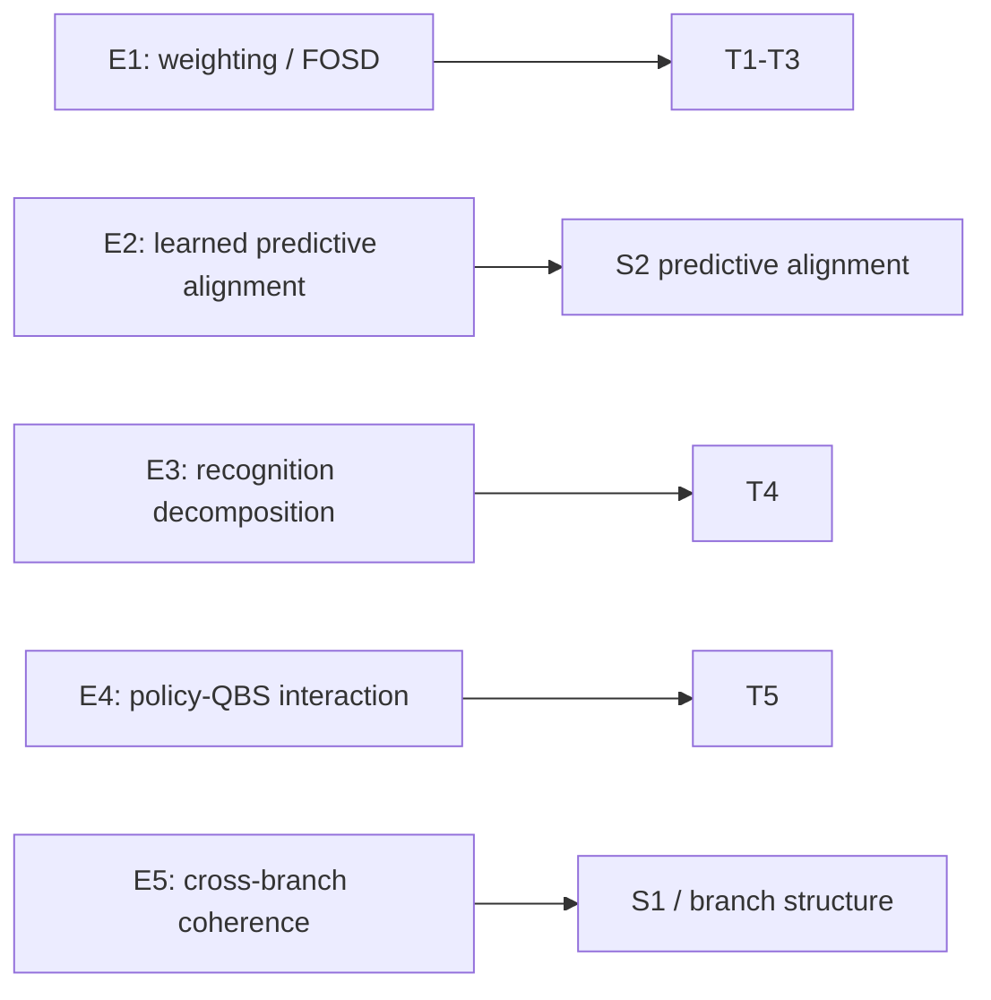
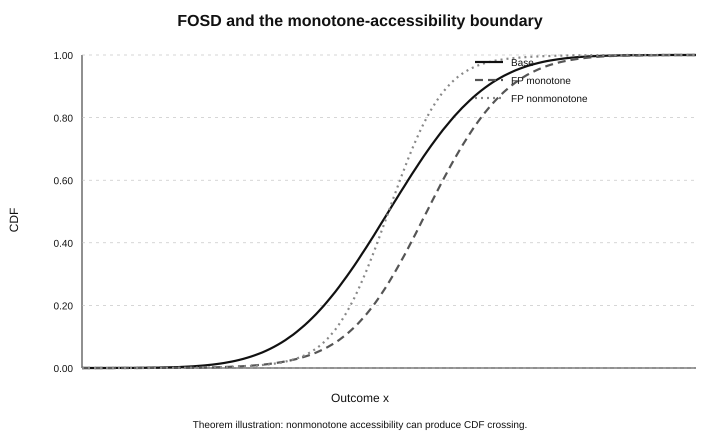
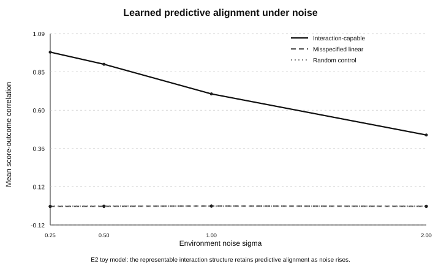
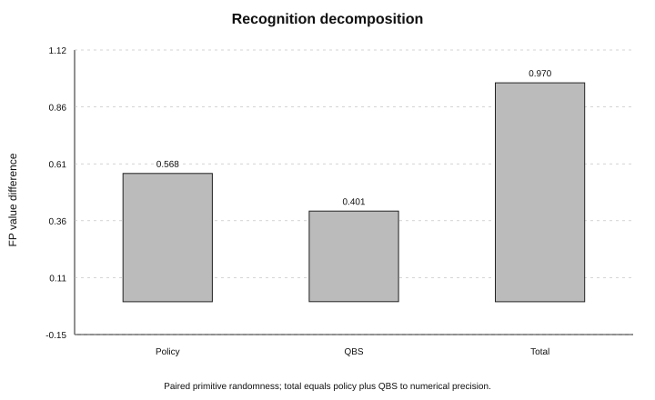
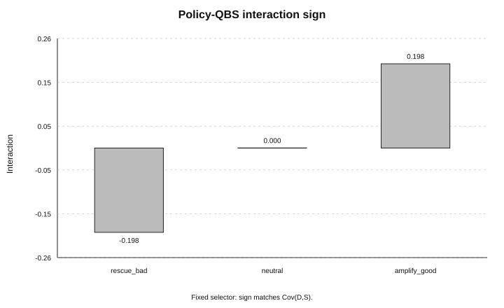
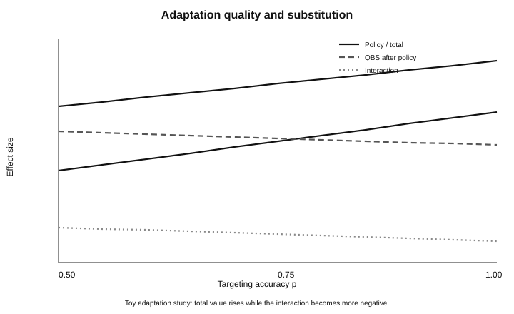
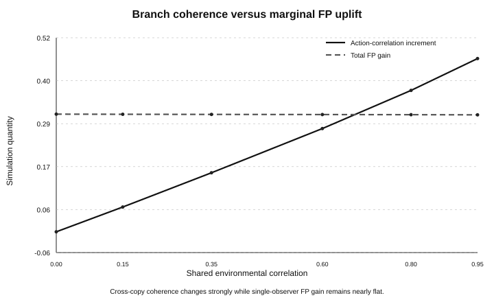

# Experiments

The five scripts correspond to the locked experiment families in `manifest.csv`. They are classical simulations or deterministic theorem illustrations of the formal QBS model; they are not empirical evidence for an Everettian accessibility law.

## Experiment map



## H/T/D/C/U index

| ID | H — hypothesis | T — test | D — result | C — control | U — boundary |
|---|---|---|---|---|---|
| [E1](E1_FOSD.md) | favorable accessibility alignment shifts FP outcomes upward | monotone and nonmonotone accessibility across toy distributions | covariance identity and FOSD direction reproduced | independence null; nonmonotone counterexample | formal weighted measure only |
| [E2](E2_LEARNED_AGENT.md) | predictive alignment can arise endogenously | interaction-capable learner vs misspecified and random controls | strong predictive ordering under learnable structure | misspecified linear and random-score controls | classical toy learner only |
| [E3](E3_RECOGNITION.md) | recognition effect separates into trajectory and conditioning components | paired primitive randomness for recognition-off/on | decomposition closes to floating-point precision | recognition-label null | physical accessibility change remains separate |
| [E4](E4_INTERACTION.md) | policy improvement and QBS conditioning can interact with either sign | rescue-bad, neutral, amplify-good and changing-selector cases | predicted covariance sign and exact decomposition reproduced | sign controls and selector-map decomposition | interaction sign is not universal |
| [E5](E5_BRANCH_MAP.md) | marginal recognition and cross-copy coherence are distinct | execution-strength, shared-environment, and shared-recognition sweeps | correlation structure changes can differ from single-copy FP gain | exact `q=0` baseline; matched marginal recognition | hierarchical classical-copy model only |

## Visual results

The visual layer deliberately distinguishes deterministic theorem illustrations, current reproduction outputs, and locked historical summaries. A figure regenerated deterministically from a committed locked CSV is reproducible as a figure, but that does not imply the current experiment script regenerated the underlying historical CSV.

### E1 — FOSD theorem boundary

[](E1_FOSD.md)

Monotone accessibility produces the theorem-predicted CDF ordering; the nonmonotone control shows why positive mean uplift alone is not enough for FOSD. This is a deterministic theorem illustration rather than a current E1 simulation-output plot.

### E2 — Learned predictive alignment

[](E2_LEARNED_AGENT.md)

The interaction-capable evaluator retains substantial score/outcome correlation as noise rises, while the misspecified linear evaluator and random control remain near zero. This is the classical toy-model mechanism behind the predictive-alignment line, not evidence for an Everett bridge. Figure 7 visualizes the locked E2 summary `qbs_nonlinear_minimal_mock_summary.csv`; the current rerun output `e2_minimal_agent_reproduction.csv` is stored separately and is not silently substituted into the locked figure.

### E3 — Recognition decomposition

[](E3_RECOGNITION.md)

The paired experiment separates the ordinary policy/trajectory term from the first-person conditioning contribution. Figure 3 reads the current reproduction output.

### E4 — Interaction sign

[](E4_INTERACTION.md)

Rescue-bad, neutral, and amplify-good policies demonstrate that the policy-QBS interaction sign is structure-dependent rather than universally positive or negative. Figure 4 reads the current fixed-selector reproduction output.

### E4 — Adaptation quality

[](E4_INTERACTION.md)

This sweep keeps policy effect, post-policy QBS contribution, interaction, and total first-person effect visually separate. Figure 5 is generated from the locked historical adaptation summary `qbs_adaptation_total_effect_summary.csv`; the current E4 reproduction script regenerates the fixed-selector and general selector-changing identities, not this historical sweep.

### E5 — Branch coherence

[](E5_BRANCH_MAP.md)

The branch-coherence plot separates cross-copy action-correlation change from single-observer first-person gain. Figure 6 reads the current paired reproduction output.

## Reproduction

Run from the repository root:

```bash
python experiments/exp1_fosd_and_stress.py
python experiments/exp2_minimal_agent.py
python experiments/exp3_recognition_decomposition.py
python experiments/exp4_interaction.py
python experiments/exp5_branch_map.py
```

Each script writes fresh reproduction outputs to `data/processed/`. The manifest distinguishes historical locked summaries from files regenerated by the current scripts.

Important reproducibility details:

- E3 uses paired primitive randomness for recognition-off/on comparisons.
- E4 regenerates both the fixed-selector sign identity and the general selector-map-shift decomposition.
- E5 reuses the same primitive random arrays across every execution-strength value and every shared-environment correlation value. It also regenerates the shared-recognition versus branch-independent-recognition comparison.

See [`../figures/README.md`](../figures/README.md) for figure provenance and regeneration details.
