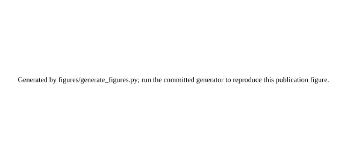

# Repository Figures

The repository contains six manuscript/publication SVG figures plus one repository-review SVG under `figures/generated/`. They are regenerated by `figures/generate_figures.py` from deterministic theorem illustrations or committed CSV outputs.

Figure provenance is intentionally separated into three source classes: deterministic theorem illustrations, current reproduction outputs regenerated by the active experiment scripts, and locked historical summaries preserved as part of a frozen experiment record. Deterministically regenerating an SVG from a committed CSV does not by itself mean that the current experiment script regenerated that CSV.

The manuscript uses PDF build products for Figures 1–6 generated by `figures/generate_pdf_figures.py`. The SVG and PDF renderers intentionally use different layout backends, but the numerical series for Figures 2–6 now come from the shared `figures/figure_data.py` contract. This prevents the public SVG and manuscript PDF implementations from silently plotting different numerical data while both still build. The PDFs are produced under `figures/generated_pdf/` during local or CI builds and do not need to be committed as binary artifacts. Figure 7 is currently a repository-review figure and is not inserted into the manuscript.

## Figure set and previews

### Figure 1 — Recognition-dependent QBS framework



**Type:** interpretation-neutral mathematical schematic. This is not a literal quantum-branch diagram.

### Figure 2 — FOSD and the monotone-accessibility boundary


**Type:** deterministic theorem illustration generated from a standard-normal base density. The nonmonotone case is included specifically to show possible CDF crossing.

### Figure 3 — Recognition decomposition


**Current reproduction source:** `data/processed/e3_recognition_decomposition_reproduction.csv`.

### Figure 4 — Policy-QBS interaction sign


**Current reproduction source:** `data/processed/e4_fixed_selector_sign_reproduction.csv`.

### Figure 5 — Adaptation quality and substitution


**Locked historical source:** `data/processed/qbs_adaptation_total_effect_summary.csv`. The current E4 reproduction script regenerates the fixed-selector sign identity and the general selector-changing decomposition; it does not regenerate this historical adaptation sweep.

### Figure 6 — Branch coherence versus marginal first-person uplift


**Current reproduction source:** `data/processed/e5_rho_paired_reproduction.csv`. Its current rho-sweep field is `action_corr_increment`; the audit corrected an earlier misleading `recognition_corr_increment` field name without changing the numerical series or the rendered figure.

### Figure 7 — Learned predictive alignment under noise


**Type:** repository-review visualization of a locked E2 simulation summary. **Locked historical source:** `data/processed/qbs_nonlinear_minimal_mock_summary.csv`, metric `corr_score_luck`. The current E2 rerun output is `data/processed/e2_minimal_agent_reproduction.csv` and is kept separate rather than silently substituted into the locked figure. The interaction-capable evaluator retains positive predictive alignment as noise rises, while the misspecified linear and random controls remain near zero.

## Reproduction

Use the repository's recorded Python version and pinned dependencies to reduce execution-environment drift:

```bash
python -m venv .venv
source .venv/bin/activate
pip install -r requirements.txt
```

For GitHub-readable SVG previews:

```bash
python figures/generate_figures.py
```

For LaTeX manuscript PDF figures:

```bash
python figures/generate_pdf_figures.py
```

The SVG generator writes Figure 2's deterministic theorem-illustration CDF data to `data/processed/fig2_fosd_theorem_illustration.csv` during regeneration. Pull-request CI showed that this floating-point CSV can differ in the last serialized bits across GitHub-hosted runner hardware even under the same pinned primary Python/NumPy/pandas stack. `scripts/validate_figure_set.py` therefore requires exact CSV structure and non-numeric cells plus `rtol=1e-12`, `atol=1e-14` for numeric cells, then restores the committed canonical CSV bytes before the workflow's later exact clean-worktree check. The committed SVG directory remains byte-compared after regeneration.

Figure-level data provenance and script-level reproducibility are related but distinct. Figures 3, 4, and 6 read current reproduction outputs; Figure 2 is a deterministic theorem illustration; Figures 5 and 7 read locked historical summaries. The experiment manifest is authoritative for which CSVs are locked and which are current reproduction outputs. For manuscript/public figure pairs 2–6, `figure_data.py` is the canonical numerical-series layer used by both renderers.

## Interpretation discipline

- Figures 2–7 display theorem illustrations or classical toy simulations, not physical Everett observables.
- Figure 1 is a model schematic, not a literal diagram of quantum branching.
- Figure 7 is a repository-review visualization, not currently a manuscript figure.
- Locked-summary figures and current-reproduction figures are labeled separately; deterministic SVG regeneration must not be conflated with regeneration of an underlying historical CSV.
- Cross-branch action correlation and single-observer first-person uplift are plotted separately because they are distinct quantities.
- Manuscript captions state whether each manuscript figure is a theorem illustration, simulation result, or interpretation schematic.

## CI

GitHub Actions uses the pinned Python/numerical environment, regenerates all seven SVGs, verifies every expected SVG output as nonsymlink regular files, validates the committed SVGs as browser-safe XML assets, and byte-compares the committed SVG directory. The deterministic Figure 2 theorem-illustration CSV is checked under the tight numerical-equivalence contract above and restored to committed canonical bytes before the exact clean-worktree gate. CI also regenerates the six manuscript PDFs as nonsymlink regular files before the LaTeX source preflight/build. Figures 2–6 obtain their numerical data through the shared `figure_data.py` layer in both renderers. Current E1–E5 reproduction CSV equivalence is checked separately in the experiment-validation stage.

See [`../docs/pre_announcement_execution_audit_2026-08-19.md`](../docs/pre_announcement_execution_audit_2026-08-19.md) for the commit-fixed execution audit and the remaining browser/Actions release gates.
